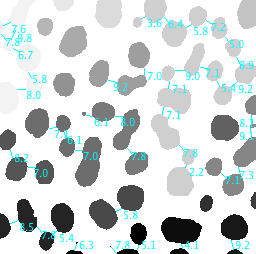

# Graph
Compute particle adjacency and distance lists

An [ImageJ plugin](https://imagej.nih.gov/ij/plugins/graph/index.html)

Graph_Demo demonstrates the creation of adjacency lists (graphs and subgraphs, aka "connected components") based upon the separation distance among particles. The image below shows the output where the user has selected a threshold distance of 10 between Edges. Particles separated by less than 10 are joined into subgraphs. Groupings are shown by color coding and connecting lines.

Suggested separation distances to use in the demo: Edges = 10, Centroids = 35 and Centers of Mass = 35

Using the plugin Graph_, the user may additionally select the binary image to operate on and the distance computation to use. Separation distances may be computed on "Edges" (as in the demo output shown below), "Centroids or "Centers of Mass". Note that to use the Graph_ plugin there must be a binary mask and there must be a populated Results Table. Each distance computation method depends upon different values being present in the Results Table. See the "Set Measurements..." and "Analyze Particles..." commands for details.

  + Edges requires `XStart` and `YStart` in the Results Table
  + Centroids requires `X` and `Y` in the Results Table
  + Centers of Mass requires `XM` and `YM` in the Results Table

 The adjacency lists (aka Connected Components) for each subgraph as shown in the log window like that shown below. Particles are identified (1,2,3,...) by the row number assigned to them in the Results Table.

Number of connected components = 22
CC-1: 1 10 13 17 24 25
CC-2: 2
CC-3: 3
CC-4: 4 7 11 6 8 14 20 26 19 16 21 27 33 41 46
CC-5: 5
CC-6: 9
CC-7: 12
CC-8: 15 23 18
CC-9: 22
CC-10: 28 36 39 47 44
CC-11: 29 31 32 42
CC-12: 30 34 40 38
CC-13: 35
CC-14: 37 43 45
CC-15: 48 52
CC-16: 49
CC-17: 50
CC-18: 51 54 58 53
CC-19: 55 63
CC-20: 56 61
CC-21: 57 62 60
CC-22: 59 64 
